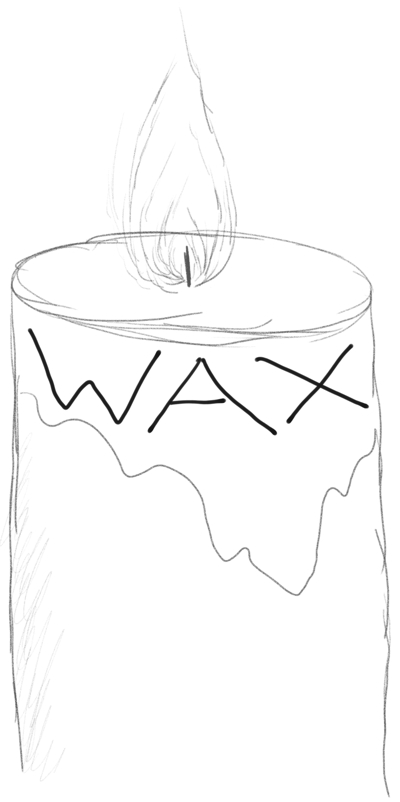

# The 2018 Workshop on Approximate Computing Across the Stack

Welcome to the 2018 Workshop on Approximate Computing Across the Stack (WAX)! WAX is a venue for research focusing on computing with unreliability and inexactness.
It will be co-located with [ASPLOS 2018][].

** Deadline Extended to 2/5! **

**Participate!** by submitting a 2-page position paper on approximate computing, a lightning talk on a provocative or controversial aspect of approximation, or a discussion topic for the workshop:

* Submit position papers [via HotCRP][hotcrp] by ~~**January 29**~~ **February 5**.
* Submit lightning talks [via email][hank-email] by **March 5**.
* Submit discussion topics [via wiki][topics] also by **March 5**.

See the [call for participation][cfp] for more details on how to get involved and what to submit.

[hotcrp]: http://www.cs.cornell.edu/conferences/wax2018/
[hank-email]: mailto:hankhoffmann@cs.uchicago.edu
[topics]: https://github.com/cucapra/wax2018/wiki/Discussion-Topics

Previous instances:

* [WAX 2017][], at ASPLOS
* [WAX 2016][], at ASPLOS
* [WAX 2015][], at FCRC
* [WACAS 2014][], at ASPLOS
* [APPROX 2014][], at PLDI

[wax 2017]: http://approximate.computer/wax2017/
[wax 2016]: http://approximate.computer/wax2016/
[asplos 2018]: https://www.asplos2018.org
[wax 2015]: http://sampa.cs.washington.edu/new/wax2015/
[wacas 2014]: http://sampa.cs.washington.edu/new/wacas14/
[approx 2014]: http://approx2014.cs.umass.edu/
[cfp]: http://approximate.computer/wax2018/cfp.html
